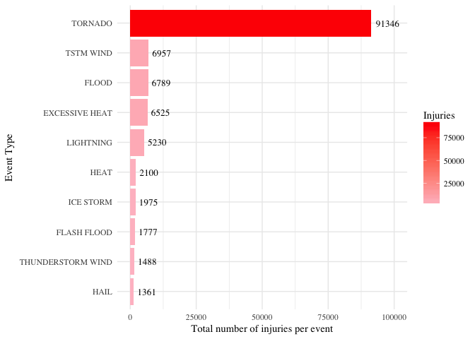

# Synopsis
Synopsis: Immediately after the title, there should be a synopsis which describes and summarizes your analysis in at most 10 complete sentences.

Storms and other severe weather events can cause both public health and economic problems for communities and municipalities. Many severe events can result in fatalities, injuries, and property damage, and preventing such outcomes to the extent possible is a key concern.

This project involves exploring the U.S. National Oceanic and Atmospheric Administration's (NOAA) storm database. This database tracks characteristics of major storms and weather events in the United States, including when and where they occur, as well as estimates of any fatalities, injuries, and property damage.


```r
# set working directory
path <- getwd()

# load packages

packages <- c("data.table", "tidyverse", "ggplo2")
sapply(packages, require, character.only = TRUE, quietly = TRUE)
```

```
## 
## Attaching package: 'data.table'
```

```
## The following objects are masked from 'package:dplyr':
## 
##     between, first, last
```

```
## The following object is masked from 'package:purrr':
## 
##     transpose
```

```
## Warning in library(package, lib.loc = lib.loc, character.only = TRUE,
## logical.return = TRUE, : there is no package called 'ggplo2'
```

```
## data.table  tidyverse     ggplo2 
##       TRUE       TRUE      FALSE
```

# Data Processing

## Step 1 - Loading Data File

From the URL “http://d396qusza40orc.cloudfront.net/repdata%2Fdata%2FStormData.csv.bz2”, the raw data will be downloaded as “StormData.csv.bz2”. Data directory will be created, if necessary.


```r
url <- "https://d396qusza40orc.cloudfront.net/repdata%2Fdata%2FStormData.csv.bz2"
data_path <- paste(path, "/data/", sep = "")
bz2 <- "StormData.bz2"
# check if directory path and file exsists
if (!file.exists(data_path)) {
    dir.create(data_path)
}
if (!file.exists(file.path(data_path, bz2))) {
    download.file(url, file.path(data_path, bz2))
}
```

## Step 2 - Loading Data into R
The downloaded zipfile will be loaded.


```r
# can read straight from file 
f <- "activity.csv"
stormDataDf <- read.csv(file.path(data_path, bz2))
```

## Step 3 - Data Processing


```r
# check the data first
str(stormDataDf)
```


```r
# select data about fatalities and injuries and group data by event type
tmpdf <- stormDataDf %>% 
    select(EVTYPE, FATALITIES, INJURIES) %>% 
    group_by(EVTYPE) %>% 
    summarize(total_f = sum(FATALITIES), total_i = sum(INJURIES)) %>% 
    arrange(desc(total_f)) 
# select top 10 fatalities for plot
top_fatalities_df10 <- tmpdf[1:10,]

# rearrange data to select top10 injuries
tmpdf <- tmpdf %>% 
    arrange(desc(total_i)) 
# select top 10 fatalities for plot
top_injuries_df10 <- tmpdf[1:10,]
```


```r
# select data, both property damage and crop damage and total of both
# Filter the subset so that either variable must have a value greater than zero. 
damage_df <- stormDataDf %>% 
    select(EVTYPE, CROPDMG, PROPDMG, PROPDMGEXP, CROPDMGEXP) %>% 
    filter(PROPDMG > 0 | CROPDMG > 0)

# Convert property damage values to a single unit, "dollars"
damage_df[damage_df$PROPDMGEXP == "H", ]$PROPDMG = damage_df[damage_df$PROPDMGEXP == "H", ]$PROPDMG * 10^2
damage_df[damage_df$PROPDMGEXP == "K", ]$PROPDMG = damage_df[damage_df$PROPDMGEXP == "K", ]$PROPDMG * 10^3
damage_df[damage_df$PROPDMGEXP == "M", ]$PROPDMG = damage_df[damage_df$PROPDMGEXP == "M", ]$PROPDMG * 10^6
damage_df[damage_df$PROPDMGEXP == "B", ]$PROPDMG = damage_df[damage_df$PROPDMGEXP == "B", ]$PROPDMG * 10^9
# Convert crop damage values to a single unit, "dollars".
damage_df[damage_df$CROPDMGEXP == "H", ]$CROPDMG = damage_df[damage_df$CROPDMGEXP == "H", ]$CROPDMG * 10^2
damage_df[damage_df$CROPDMGEXP == "K", ]$CROPDMG = damage_df[damage_df$CROPDMGEXP == "K", ]$CROPDMG * 10^3
damage_df[damage_df$CROPDMGEXP == "M", ]$CROPDMG = damage_df[damage_df$CROPDMGEXP == "M", ]$CROPDMG * 10^6
damage_df[damage_df$CROPDMGEXP == "B", ]$CROPDMG = damage_df[damage_df$CROPDMGEXP == "B", ]$CROPDMG * 10^9

# group data and summarize by event
damage_df <- damage_df %>% 
    group_by(EVTYPE) %>% 
    summarize(Crop = sum(CROPDMG)/10^3, Property = sum(PROPDMG)/10^3, total_t = (sum(CROPDMG)+sum(PROPDMG))/10^3) %>% 
    arrange(desc(total_t)) 

# find top 10 event with most lost value
top_damage_df10 <- damage_df[1:10,"EVTYPE"]

#select those top10 for final plot
damage_df <- damage_df %>% 
    filter(EVTYPE %in% top_damage_df10$EVTYPE)
#melt data by type of damage
mdata <- melt(damage_df, id=c("EVTYPE", "total_t"))
```

# Step 4 - Plot Processing


```r
# plot data
plot_fatalities <- ggplot(data = top_fatalities_df10, 
                          aes(x = reorder(EVTYPE, total_f), y = total_f, fill = total_f))
# adjust aesthetics
plot_fatalities <- plot_fatalities + geom_bar(stat="identity") +
    scale_fill_continuous(low="steelblue", high="black") +
    geom_text(aes(label = total_f), hjust=-0.2, size=3.5, family = "Times") +
    scale_y_continuous(limits = c(0,ceiling(top_fatalities_df10[1,]$total_f/1000)*1000)) + 
    coord_flip() + 
    xlab("Event Type") + 
    ylab("Total number of fatalities per event") + 
    labs(fill = "Fatalities") + 
    theme_minimal(base_family = "Times")
```


```r
# plot data
plot_injuries <- ggplot(data = top_injuries_df10, aes(x = reorder(EVTYPE, total_i), y = total_i, fill = total_i))
# adjust aesthetics
plot_injuries <- plot_injuries + geom_bar(stat="identity") +
    scale_fill_continuous(low="pink", high="red") +
    geom_text(aes(label = total_i), hjust=-0.2, size=3.5, family = "Times") +
    scale_y_continuous(limits = c(0,ceiling(top_injuries_df10[1,]$total_i/10000)*10000)) + 
    coord_flip() + 
    xlab("Event Type") + 
    ylab("Total number of injuries per event") + 
    labs(fill = "Injuries") + 
    theme_minimal(base_family = "Times")
```


```r
# plot data
plot_damage <- ggplot(mdata, 
                       aes(x = reorder(EVTYPE, total_t), y = value, fill = variable, 
                           label = round(value, digits = 0))) +
    geom_bar(stat = "identity", position = "stack")
# adjust aesthetics
plot_damage <- plot_damage + coord_flip() + 
    scale_y_continuous(limits = c(0,ceiling(mdata[1,]$total_t/1000)*1000)) + 
    geom_text(size = 3, position = position_stack(vjust = 0.5), hjust=-.25, family = "Times") + 
    xlab("Event Type") + 
    ylab("Total damage (in millions USD)") + 
    labs(fill = "Type of\ndamage") + 
    theme_minimal(base_family = "Times")
```

# Results 

## 1. Across the United States, which types of events (as indicated in the EVTYPE variable) are most harmful with respect to population health?

Following plot shows which types of events are most harmfull in terms of fatalities


```r
plot_fatalities
```

<!-- -->

Following plot shows which types of events are most harmfull in terms of injuries


```r
plot_injuries
```

<!-- -->

## 2. Across the United States, which types of events have the greatest economic consequences?

Following plot shows which types of events are have most consequences both for properties and crops


```r
plot_damage
```

<!-- -->
